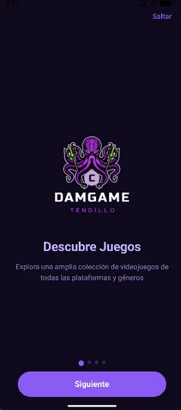
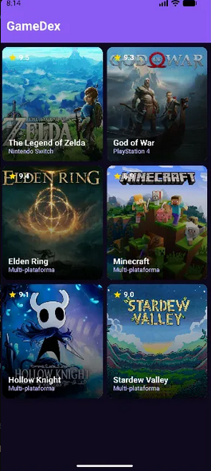
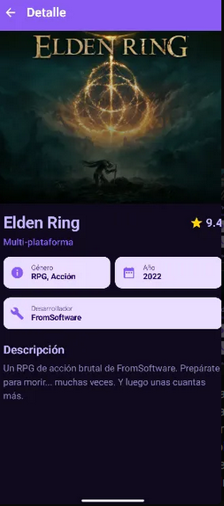

# 🎮 GameDex

Aplicación Android para explorar un catálogo de videojuegos, desarrollada con Kotlin y Jetpack Compose para el módulo PMDM.

Cada juego incluye título, plataforma, género, año de lanzamiento, desarrollador, puntuación y descripción.

---

## ✨ Características

- SplashScreen al iniciar la app
- Onboarding de 4 pantallas con opción de saltar
- Catálogo de juegos con portadas, puntuaciones y plataformas
- Pantalla de detalle con imagen animada e información completa
- Versión en portrait y landscape
- Tema oscuro personalizado con colores morados

---

## 📸 Capturas

*Onboarding*

*Catálogo de juegos*

*Detalle del juego*

---

## 🛠️ Tecnologías

- Kotlin
- Jetpack Compose
- Navigation Component
- Tema personalizado

---

## 📌 Notas

El catálogo de juegos está precargado. Una versión futura podría incluir la opción de añadir juegos propios con una base de datos local.

> Las imágenes de los videojuegos pertenecen a sus respectivos desarrolladores y distribuidores.

---

## 🎓 Contexto académico

Proyecto del módulo de **Programación Multimedia y Dispositivos Móviles (PMDM)**.
